# Domain Understanding: Fajné Sklady (Storage Rental Platform)

## Overview

**Fajné Sklady** is a B2C marketplace for self-storage rental. It connects landlords (warehouse owners) with tenants (customers) who need storage space. The platform handles:

- Storage unit listings and availability
- Order processing and payment (GoPay integration)
- Recurring billing for unlimited rentals
- Contract management
- Invoicing (Fakturoid integration)

---

## User Roles

| Role | Czech Name | Description |
|------|-----------|-------------|
| **ROLE_USER** | Nájemce (Tenant) | Customers who rent storage units |
| **ROLE_LANDLORD** | Pronajímatel | Warehouse owners who list storage |
| **ROLE_ADMIN** | Administrátor | Platform administrators |

**Hierarchy:** `ROLE_ADMIN → ROLE_LANDLORD → ROLE_USER`

---

## Core Entities

### User
- Registration with email verification (customers) or direct access (landlords)
- Billing info for invoicing (company, IČO, DIČ, address)
- Landlord-specific: commission rate, self-billing prefix for invoice numbering

### Place
- Physical warehouse location (address, coordinates, map image)
- Contains multiple Storage units
- `daysInAdvance`: minimum booking lead time

### StorageType
- Template defining dimensions (inner/outer) and default pricing
- `uniformStorages`: if true, system auto-assigns; if false, customer picks from visual map

### Storage
- Individual rentable unit within a Place
- References a StorageType for dimensions
- Status: `AVAILABLE → RESERVED → OCCUPIED → AVAILABLE`
- Can override default pricing and commission rate
- Canvas coordinates for visual map placement

### Order
- Customer booking request
- Status flow: `CREATED → RESERVED → AWAITING_PAYMENT → PAID → COMPLETED`
- Terminal states: `COMPLETED`, `CANCELLED`, `EXPIRED`
- Expiration: 24 hours from creation
- Types: LIMITED (fixed dates) or UNLIMITED (ongoing)

### Contract
- Created when Order completes (PAID → COMPLETED)
- Handles recurring billing for UNLIMITED rentals
- Can be terminated early (releases storage)

### Invoice / SelfBillingInvoice
- Invoice: customer-facing (one-time orders)
- SelfBillingInvoice: landlord commission invoices (monthly aggregation)

---

## Main Business Flows

### 1. Customer Registration
```
Register → Email Verification → Welcome Email → Portal Access
```
- Validation: unique email, 8+ char password, terms acceptance

### 2. Landlord Registration
```
Register with Billing Info → Direct Portal Access
```
- No email verification required
- Must provide company info (IČO, address)

### 3. Order & Payment Flow
```
Select Storage → Create Order → Payment (GoPay) → Invoice Generated → Contract Created
```

**Key Events:**
| Event | Side Effect |
|-------|-------------|
| `OrderCreated` | Confirmation email (24h expiry warning) |
| `OrderPaid` | Invoice generated, PDF emailed |
| `OrderCompleted` | Contract created, notification sent |

### 4. Recurring Billing (Unlimited Rentals)
```
Monthly Charge → Success: Invoice sent
             → Failure: Retry in 3 days (1 retry max)
```

### 5. Contract Termination
- User: can terminate UNLIMITED contracts only
- Admin: can terminate any contract
- Effect: releases storage, stops recurring billing

---

## Authorization Matrix

| Action | Admin | Landlord | User |
|--------|-------|----------|------|
| **Places** | | | |
| View all | ✅ | ✅ | ❌ |
| Create/Edit/Delete | ✅ | ❌ | ❌ |
| Request changes | ✅ | ✅ (if has access) | ❌ |
| **Storages** | | | |
| View all | ✅ | Own only | ❌ |
| Edit/Prices/Photos | ✅ | Own only | ❌ |
| Delete | ✅ | ❌ | ❌ |
| Assign owner | ✅ | ❌ | ❌ |
| **Storage Types** | | | |
| View | ✅ | ✅ | ❌ |
| Create/Edit/Delete | ✅ | ❌ | ❌ |
| **Orders** | | | |
| View all | ✅ | Own storages | Own only |
| Cancel | ✅ | ❌ | Own only |
| **Contracts** | | | |
| View | ✅ | Own storages | Own only |
| Terminate | ✅ | ❌ | Unlimited only |

---

## Key Business Rules

1. **Storage Status Transitions**
   - Only AVAILABLE storages can be ordered
   - Order.reserve() → Storage.RESERVED
   - Order.complete() → Storage.OCCUPIED
   - Contract.terminate() or Order.cancel() → Storage.AVAILABLE

2. **Pricing Hierarchy**
   - Storage price overrides → StorageType default price
   - Prices stored in cents, displayed in CZK

3. **Advance Booking**
   - Place.daysInAdvance enforced at order creation
   - Start date must be ≥ today + daysInAdvance

4. **Order Expiration**
   - Orders expire 24 hours after creation if not paid
   - Expired orders release reserved storage

5. **Recurring Payment Retry**
   - First failure: retry after 3 days
   - Second failure: manual intervention required
   - Contract.failedBillingAttempts tracks retries

6. **Invoice Numbering**
   - SelfBillingInvoice format: `{PREFIX}-{YEAR}-{XXXX}`
   - Landlord must have selfBillingPrefix set
   - LandlordInvoiceSequence tracks per-year counter

---

## Validation Rules Summary

| Entity | Rule |
|--------|------|
| User.email | Unique, valid format |
| User.password | Min 8 characters |
| Company IČO | Exactly 8 digits |
| Company DIČ | Format: CZxxxxxxxx |
| Order.startDate | ≥ today + place.daysInAdvance |
| Order.endDate | > startDate (if LIMITED rental) |
| Map image | JPEG/PNG/WebP, max 5MB |

---

## Domain Events Architecture

All events are `final readonly class` with `occurredOn: DateTimeImmutable`

**Event Flow:**
1. Entity records event via `HasEvents` trait
2. `DomainEventsSubscriber` collects on persist/update
3. Events dispatched via event bus after Doctrine flush
4. Handlers execute side effects (emails, invoicing)

---

## External Integrations

- **GoPay**: Payment gateway for one-time and recurring payments
- **Fakturoid**: Invoice generation and management
- **Email**: Verification, notifications, invoices

---

## Visual Storage Map

Non-uniform storage types use canvas-based visual selection:
- Storage.coordinates: `{x, y, width, height, rotation}`
- Customers click to select specific unit
- Color-coded: available (green), occupied (red), unavailable (gray)

---

## Diagrams

### Entity Relationship Diagram

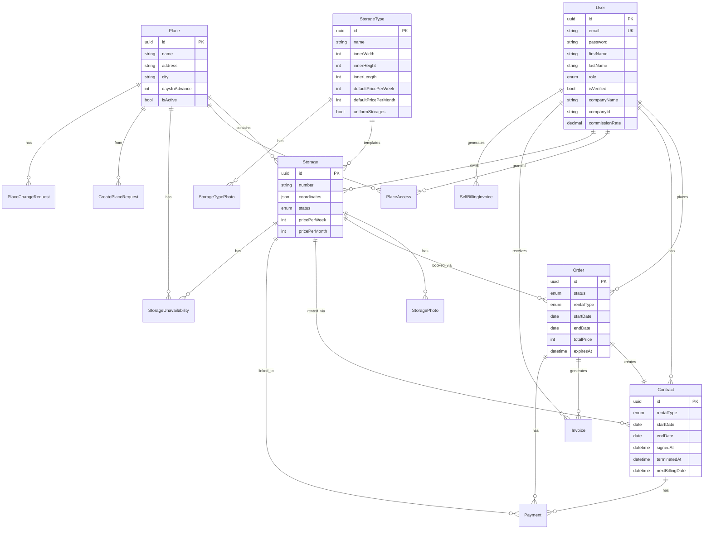
```mermaid
erDiagram
    User ||--o{ Order : places
    User ||--o{ Contract : has
    User ||--o{ PlaceAccess : granted
    User ||--o{ Storage : owns
    User ||--o{ Invoice : receives
    User ||--o{ SelfBillingInvoice : generates

    Place ||--o{ Storage : contains
    Place ||--o{ PlaceAccess : allows
    Place ||--o{ StorageUnavailability : has
    Place ||--o{ CreatePlaceRequest : from
    Place ||--o{ PlaceChangeRequest : has

    StorageType ||--o{ Storage : templates
    StorageType ||--o{ StorageTypePhoto : has

    Storage ||--o{ StoragePhoto : has
    Storage ||--o{ Order : booked_via
    Storage ||--o{ Contract : rented_via
    Storage ||--o{ Payment : linked_to
    Storage ||--o{ StorageUnavailability : has

    Order ||--|| Contract : creates
    Order ||--o{ Invoice : generates
    Order ||--o{ Payment : has

    Contract ||--o{ Payment : has

    User {
        uuid id PK
        string email UK
        string password
        string firstName
        string lastName
        enum role
        bool isVerified
        string companyName
        string companyId
        decimal commissionRate
    }

    Place {
        uuid id PK
        string name
        string address
        string city
        int daysInAdvance
        bool isActive
    }

    StorageType {
        uuid id PK
        string name
        int innerWidth
        int innerHeight
        int innerLength
        int defaultPricePerWeek
        int defaultPricePerMonth
        bool uniformStorages
    }

    Storage {
        uuid id PK
        string number
        json coordinates
        enum status
        int pricePerWeek
        int pricePerMonth
    }

    Order {
        uuid id PK
        enum status
        enum rentalType
        date startDate
        date endDate
        int totalPrice
        datetime expiresAt
    }

    Contract {
        uuid id PK
        enum rentalType
        date startDate
        date endDate
        datetime signedAt
        datetime terminatedAt
        datetime nextBillingDate
    }
```

### Order Status State Machine

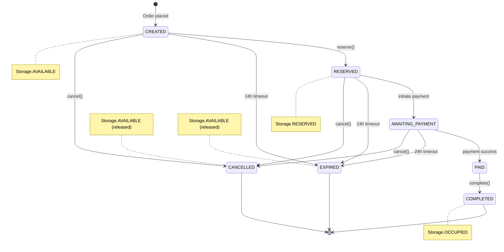
```mermaid
stateDiagram-v2
    [*] --> CREATED: Order placed

    CREATED --> RESERVED: reserve()
    CREATED --> EXPIRED: 24h timeout
    CREATED --> CANCELLED: cancel()

    RESERVED --> AWAITING_PAYMENT: initiate payment
    RESERVED --> EXPIRED: 24h timeout
    RESERVED --> CANCELLED: cancel()

    AWAITING_PAYMENT --> PAID: payment success
    AWAITING_PAYMENT --> EXPIRED: 24h timeout
    AWAITING_PAYMENT --> CANCELLED: cancel()

    PAID --> COMPLETED: complete()

    COMPLETED --> [*]
    CANCELLED --> [*]
    EXPIRED --> [*]

    note right of CREATED: Storage.AVAILABLE
    note right of RESERVED: Storage.RESERVED
    note right of COMPLETED: Storage.OCCUPIED
    note left of CANCELLED: Storage.AVAILABLE (released)
    note left of EXPIRED: Storage.AVAILABLE (released)
```

### Storage Status State Machine

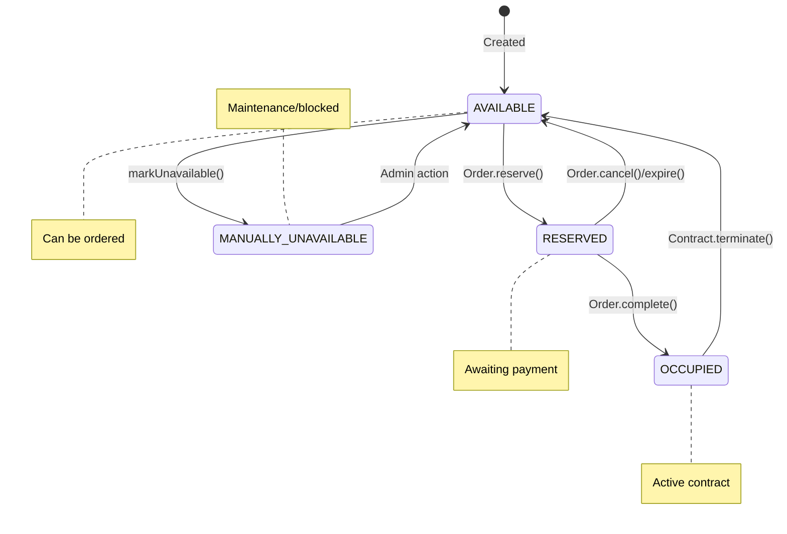
```mermaid
stateDiagram-v2
    [*] --> AVAILABLE: Created

    AVAILABLE --> RESERVED: Order.reserve()
    AVAILABLE --> MANUALLY_UNAVAILABLE: markUnavailable()

    RESERVED --> OCCUPIED: Order.complete()
    RESERVED --> AVAILABLE: Order.cancel()/expire()

    OCCUPIED --> AVAILABLE: Contract.terminate()

    MANUALLY_UNAVAILABLE --> AVAILABLE: Admin action

    note right of AVAILABLE: Can be ordered
    note right of RESERVED: Awaiting payment
    note right of OCCUPIED: Active contract
    note left of MANUALLY_UNAVAILABLE: Maintenance/blocked
```

### Order & Payment Flow (Sequence)

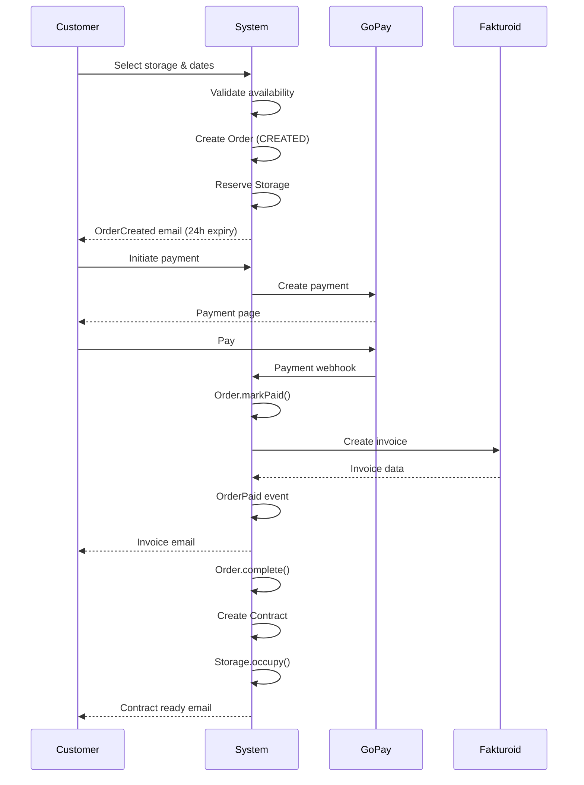
```mermaid
sequenceDiagram
    participant C as Customer
    participant S as System
    participant G as GoPay
    participant F as Fakturoid

    C->>S: Select storage & dates
    S->>S: Validate availability
    S->>S: Create Order (CREATED)
    S->>S: Reserve Storage
    S-->>C: OrderCreated email (24h expiry)

    C->>S: Initiate payment
    S->>G: Create payment
    G-->>C: Payment page
    C->>G: Pay
    G->>S: Payment webhook
    S->>S: Order.markPaid()

    S->>F: Create invoice
    F-->>S: Invoice data
    S->>S: OrderPaid event
    S-->>C: Invoice email

    S->>S: Order.complete()
    S->>S: Create Contract
    S->>S: Storage.occupy()
    S-->>C: Contract ready email
```

### User Registration Flow

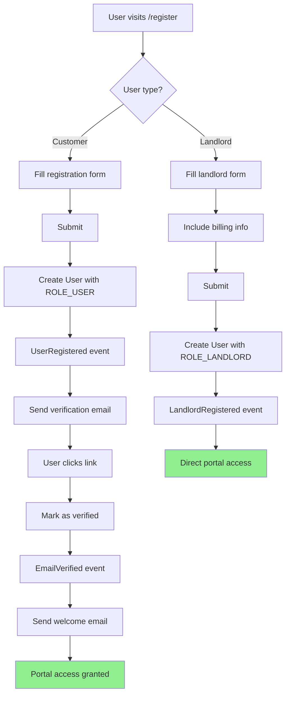
```mermaid
flowchart TD
    A[User visits /register] --> B{User type?}

    B -->|Customer| C[Fill registration form]
    C --> D[Submit]
    D --> E[Create User with ROLE_USER]
    E --> F[UserRegistered event]
    F --> G[Send verification email]
    G --> H[User clicks link]
    H --> I[Mark as verified]
    I --> J[EmailVerified event]
    J --> K[Send welcome email]
    K --> L[Portal access granted]

    B -->|Landlord| M[Fill landlord form]
    M --> N[Include billing info]
    N --> O[Submit]
    O --> P[Create User with ROLE_LANDLORD]
    P --> Q[LandlordRegistered event]
    Q --> R[Direct portal access]

    style L fill:#90EE90
    style R fill:#90EE90
```

### Recurring Billing Flow

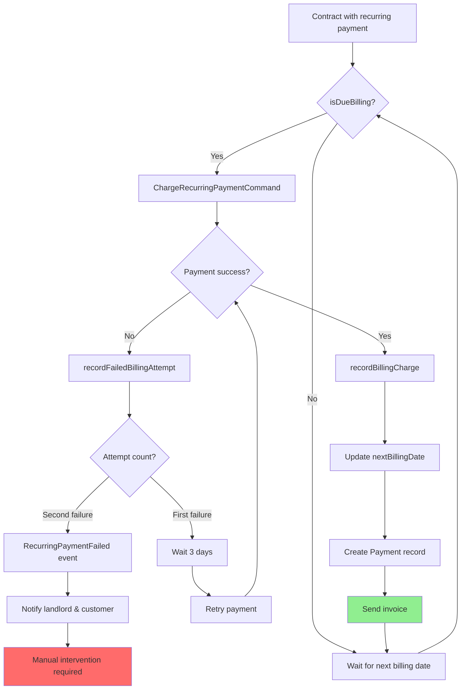
```mermaid
flowchart TD
    A[Contract with recurring payment] --> B{isDueBilling?}

    B -->|No| C[Wait for next billing date]
    C --> B

    B -->|Yes| D[ChargeRecurringPaymentCommand]
    D --> E{Payment success?}

    E -->|Yes| F[recordBillingCharge]
    F --> G[Update nextBillingDate]
    G --> H[Create Payment record]
    H --> I[Send invoice]
    I --> C

    E -->|No| J[recordFailedBillingAttempt]
    J --> K{Attempt count?}

    K -->|First failure| L[Wait 3 days]
    L --> M[Retry payment]
    M --> E

    K -->|Second failure| N[RecurringPaymentFailed event]
    N --> O[Notify landlord & customer]
    O --> P[Manual intervention required]

    style I fill:#90EE90
    style P fill:#FF6B6B
```

### Authorization Flow

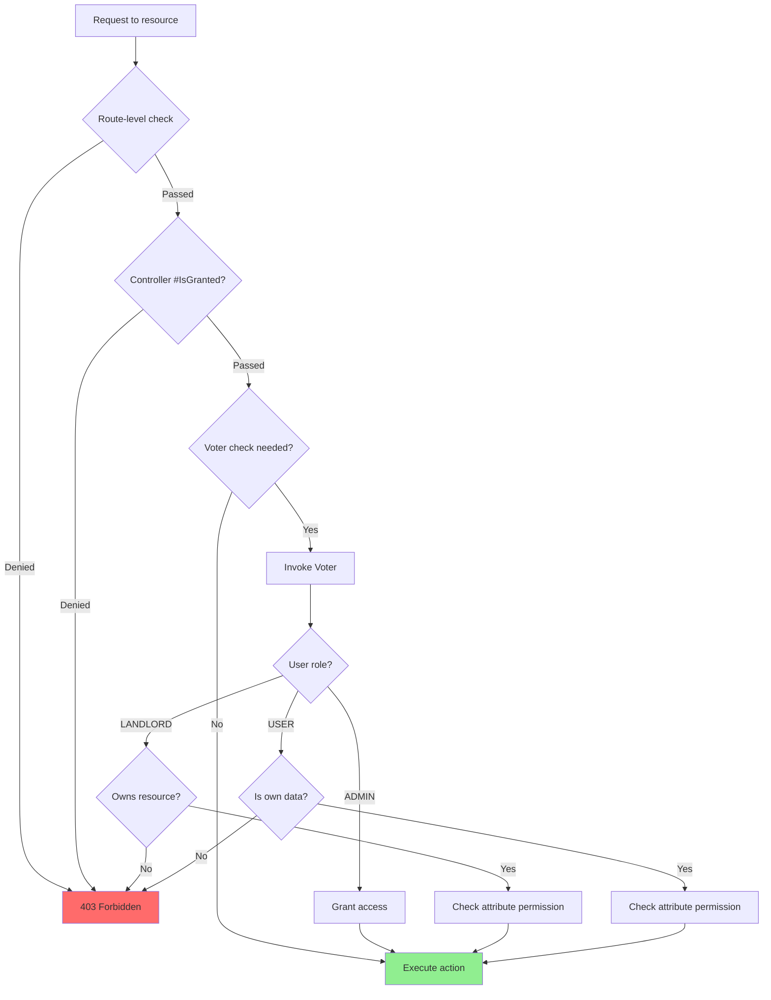
```mermaid
flowchart TD
    A[Request to resource] --> B{Route-level check}

    B -->|Denied| Z[403 Forbidden]
    B -->|Passed| C{Controller #IsGranted?}

    C -->|Denied| Z
    C -->|Passed| D{Voter check needed?}

    D -->|No| E[Execute action]
    D -->|Yes| F[Invoke Voter]

    F --> G{User role?}

    G -->|ADMIN| H[Grant access]
    G -->|LANDLORD| I{Owns resource?}
    G -->|USER| J{Is own data?}

    I -->|Yes| K[Check attribute permission]
    I -->|No| Z

    J -->|Yes| L[Check attribute permission]
    J -->|No| Z

    H --> E
    K --> E
    L --> E

    style E fill:#90EE90
    style Z fill:#FF6B6B
```

### Domain Events Flow

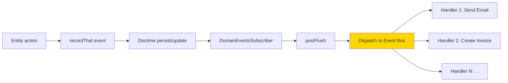
```mermaid
flowchart LR
    A[Entity action] --> B[recordThat event]
    B --> C[Doctrine persist/update]
    C --> D[DomainEventsSubscriber]
    D --> E[postFlush]
    E --> F[Dispatch to Event Bus]
    F --> G[Handler 1: Send Email]
    F --> H[Handler 2: Create Invoice]
    F --> I[Handler N: ...]

    style F fill:#FFD700
```

### Contract Lifecycle

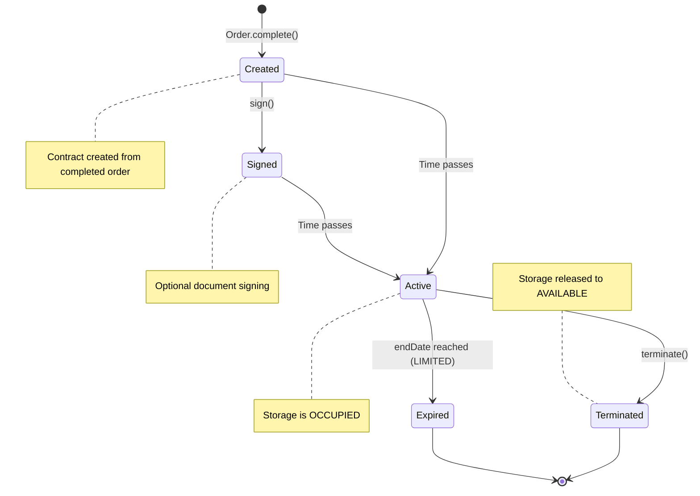
```mermaid
stateDiagram-v2
    [*] --> Created: Order.complete()

    Created --> Signed: sign()
    Created --> Active: Time passes

    Signed --> Active: Time passes

    Active --> Terminated: terminate()
    Active --> Expired: endDate reached (LIMITED)

    Terminated --> [*]
    Expired --> [*]

    note right of Created: Contract created from completed order
    note right of Signed: Optional document signing
    note right of Active: Storage is OCCUPIED
    note left of Terminated: Storage released to AVAILABLE
```

### Contract Billing States (Unlimited Rentals)

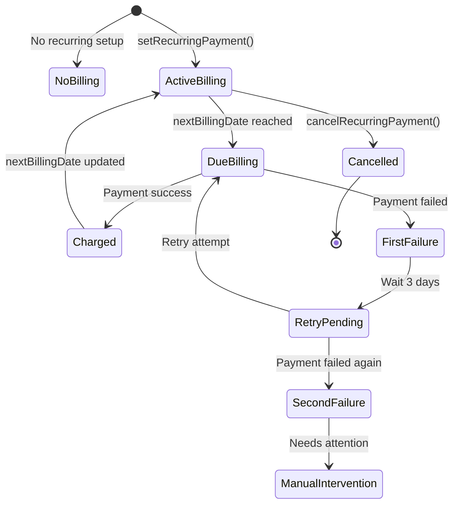
```mermaid
stateDiagram-v2
    [*] --> NoBilling: No recurring setup

    [*] --> ActiveBilling: setRecurringPayment()

    ActiveBilling --> DueBilling: nextBillingDate reached
    DueBilling --> Charged: Payment success
    Charged --> ActiveBilling: nextBillingDate updated

    DueBilling --> FirstFailure: Payment failed
    FirstFailure --> RetryPending: Wait 3 days
    RetryPending --> DueBilling: Retry attempt
    RetryPending --> SecondFailure: Payment failed again

    SecondFailure --> ManualIntervention: Needs attention

    ActiveBilling --> Cancelled: cancelRecurringPayment()
    Cancelled --> [*]
```

### Place & Storage Hierarchy

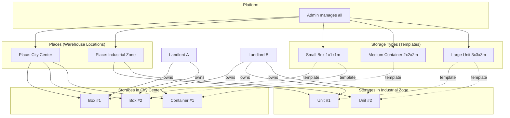
```mermaid
flowchart TD
    subgraph Platform
        Admin[Admin manages all]
    end

    subgraph Places["Places (Warehouse Locations)"]
        P1[Place: City Center]
        P2[Place: Industrial Zone]
    end

    subgraph Types["Storage Types (Templates)"]
        ST1[Small Box 1x1x1m]
        ST2[Medium Container 2x2x2m]
        ST3[Large Unit 3x3x3m]
    end

    subgraph Storages1["Storages in City Center"]
        S1[Box #1]
        S2[Box #2]
        S3[Container #1]
    end

    subgraph Storages2["Storages in Industrial Zone"]
        S4[Unit #1]
        S5[Unit #2]
    end

    Admin --> P1
    Admin --> P2
    Admin --> ST1
    Admin --> ST2
    Admin --> ST3

    P1 --> S1
    P1 --> S2
    P1 --> S3

    P2 --> S4
    P2 --> S5

    ST1 -.->|template| S1
    ST1 -.->|template| S2
    ST2 -.->|template| S3
    ST3 -.->|template| S4
    ST3 -.->|template| S5

    L1[Landlord A] -->|owns| S1
    L1 -->|owns| S2
    L2[Landlord B] -->|owns| S3
    L2 -->|owns| S4
    L2 -->|owns| S5
```

### Invoice Types & Flow


```mermaid
flowchart TD
    subgraph CustomerInvoice["Customer Invoice (Invoice entity)"]
        A[Order completed] --> B[IssueInvoiceOnPaymentHandler]
        B --> C[Create Invoice via Fakturoid]
        C --> D[Store fakturoidInvoiceId]
        D --> E[InvoiceCreated event]
        E --> F[Email invoice PDF to customer]
    end

    subgraph LandlordInvoice["Landlord Self-Billing Invoice"]
        G[Monthly scheduled job] --> H[Aggregate payments for landlord]
        H --> I[Calculate commission]
        I --> J[Get next invoice number]
        J --> K[Create SelfBillingInvoice]
        K --> L[Generate PDF]
        L --> M[Email to landlord]
    end

    subgraph InvoiceNumbering["Invoice Number Generation"]
        N[Landlord with prefix 'ABC'] --> O[LandlordInvoiceSequence]
        O --> P[Year: 2026, lastNumber: 5]
        P --> Q[Format: ABC-2026-0006]
    end
```

### Password Reset Flow

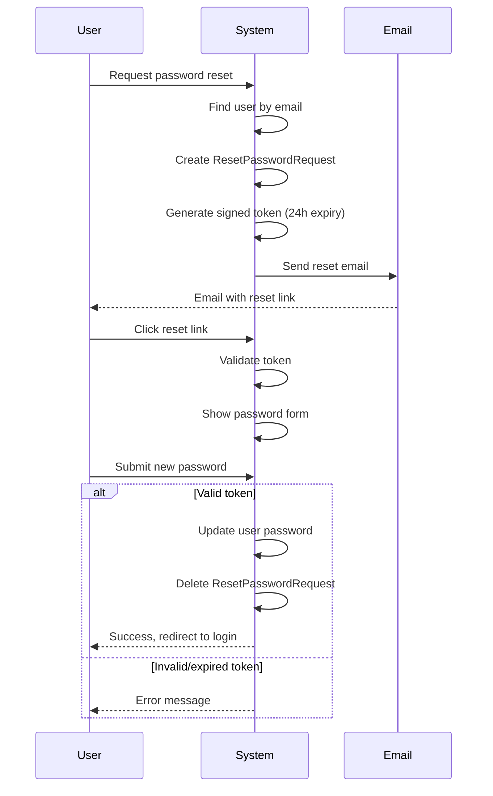
```mermaid
sequenceDiagram
    participant U as User
    participant S as System
    participant E as Email

    U->>S: Request password reset
    S->>S: Find user by email
    S->>S: Create ResetPasswordRequest
    S->>S: Generate signed token (24h expiry)
    S->>E: Send reset email
    E-->>U: Email with reset link

    U->>S: Click reset link
    S->>S: Validate token
    S->>S: Show password form
    U->>S: Submit new password

    alt Valid token
        S->>S: Update user password
        S->>S: Delete ResetPasswordRequest
        S-->>U: Success, redirect to login
    else Invalid/expired token
        S-->>U: Error message
    end
```

### Place Change Request Workflow

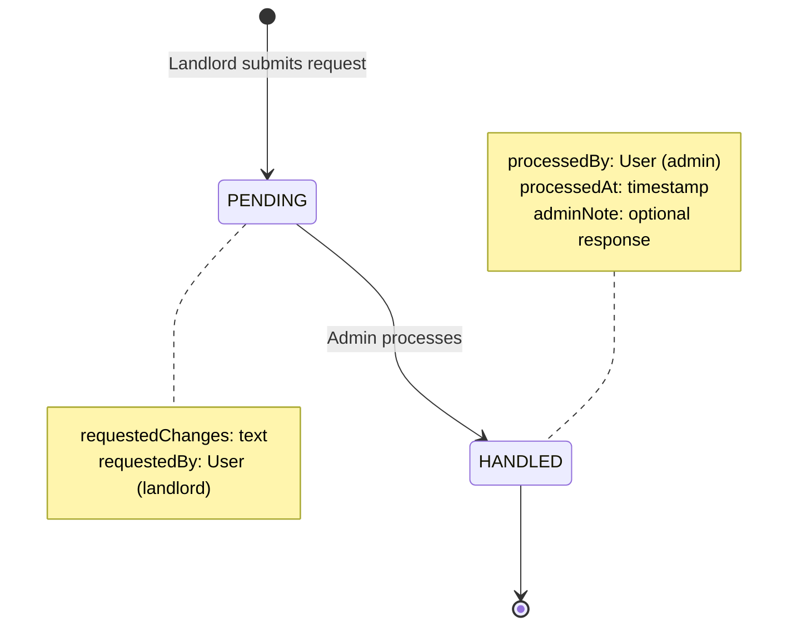
```mermaid
stateDiagram-v2
    [*] --> PENDING: Landlord submits request

    PENDING --> HANDLED: Admin processes

    HANDLED --> [*]

    note right of PENDING
        requestedChanges: text
        requestedBy: User (landlord)
    end note

    note left of HANDLED
        processedBy: User (admin)
        processedAt: timestamp
        adminNote: optional response
    end note
```

### Create Place Request Workflow

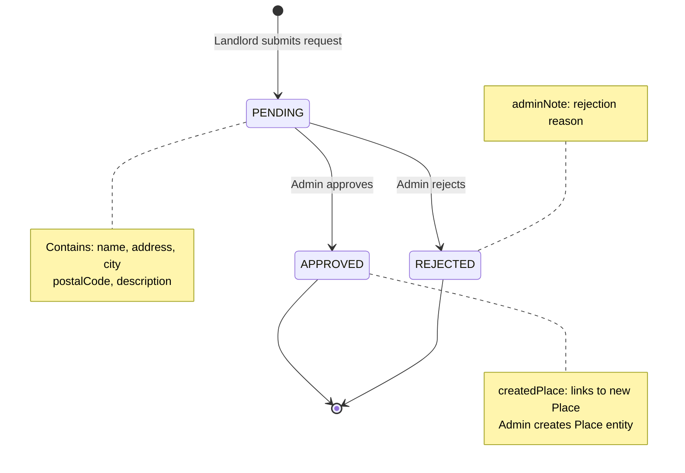
```mermaid
stateDiagram-v2
    [*] --> PENDING: Landlord submits request

    PENDING --> APPROVED: Admin approves
    PENDING --> REJECTED: Admin rejects

    APPROVED --> [*]
    REJECTED --> [*]

    note right of PENDING
        Contains: name, address, city
        postalCode, description
    end note

    note right of APPROVED
        createdPlace: links to new Place
        Admin creates Place entity
    end note

    note left of REJECTED
        adminNote: rejection reason
    end note
```

### Dashboard Views by Role

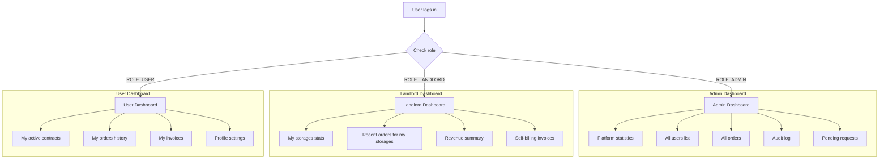
```mermaid
flowchart TD
    A[User logs in] --> B{Check role}

    B -->|ROLE_ADMIN| C[Admin Dashboard]
    B -->|ROLE_LANDLORD| D[Landlord Dashboard]
    B -->|ROLE_USER| E[User Dashboard]

    subgraph AdminDash["Admin Dashboard"]
        C --> C1[Platform statistics]
        C --> C2[All users list]
        C --> C3[All orders]
        C --> C4[Audit log]
        C --> C5[Pending requests]
    end

    subgraph LandlordDash["Landlord Dashboard"]
        D --> D1[My storages stats]
        D --> D2[Recent orders for my storages]
        D --> D3[Revenue summary]
        D --> D4[Self-billing invoices]
    end

    subgraph UserDash["User Dashboard"]
        E --> E1[My active contracts]
        E --> E2[My orders history]
        E --> E3[My invoices]
        E --> E4[Profile settings]
    end
```

### Email Verification Flow

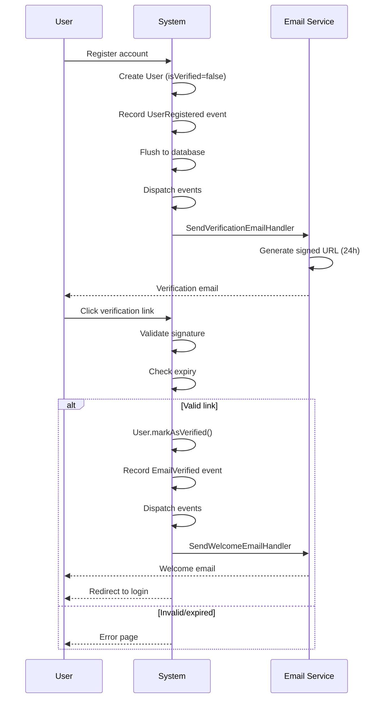
```mermaid
sequenceDiagram
    participant U as User
    participant S as System
    participant E as Email Service

    U->>S: Register account
    S->>S: Create User (isVerified=false)
    S->>S: Record UserRegistered event
    S->>S: Flush to database
    S->>S: Dispatch events

    S->>E: SendVerificationEmailHandler
    E->>E: Generate signed URL (24h)
    E-->>U: Verification email

    U->>S: Click verification link
    S->>S: Validate signature
    S->>S: Check expiry

    alt Valid link
        S->>S: User.markAsVerified()
        S->>S: Record EmailVerified event
        S->>S: Dispatch events
        S->>E: SendWelcomeEmailHandler
        E-->>U: Welcome email
        S-->>U: Redirect to login
    else Invalid/expired
        S-->>U: Error page
    end
```

### Storage Selection Modes

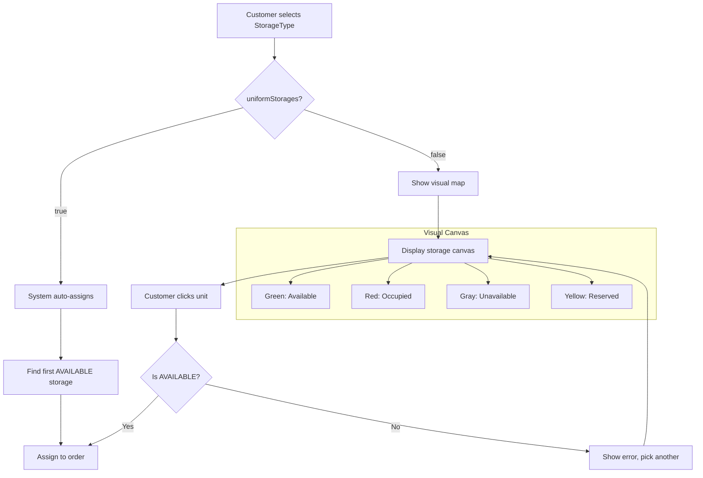
```mermaid
flowchart TD
    A[Customer selects StorageType] --> B{uniformStorages?}

    B -->|true| C[System auto-assigns]
    C --> D[Find first AVAILABLE storage]
    D --> E[Assign to order]

    B -->|false| F[Show visual map]
    F --> G[Display storage canvas]
    G --> H[Customer clicks unit]
    H --> I{Is AVAILABLE?}
    I -->|Yes| E
    I -->|No| J[Show error, pick another]
    J --> G

    subgraph Canvas["Visual Canvas"]
        G --> G1[Green: Available]
        G --> G2[Red: Occupied]
        G --> G3[Gray: Unavailable]
        G --> G4[Yellow: Reserved]
    end
```

### Pricing Resolution

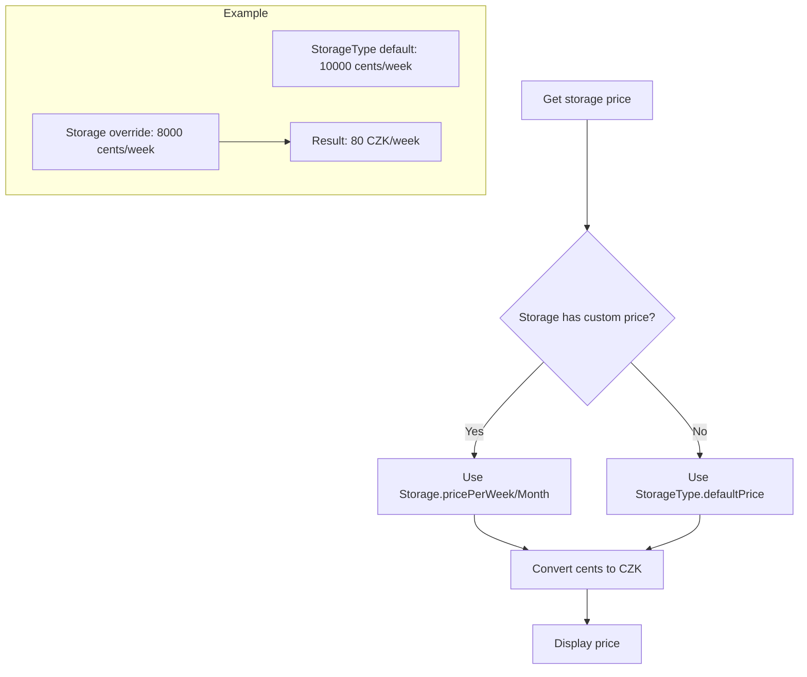
```mermaid
flowchart TD
    A[Get storage price] --> B{Storage has custom price?}

    B -->|Yes| C[Use Storage.pricePerWeek/Month]
    B -->|No| D[Use StorageType.defaultPrice]

    C --> E[Convert cents to CZK]
    D --> E

    E --> F[Display price]

    subgraph Example["Example"]
        G[StorageType default: 10000 cents/week]
        H[Storage override: 8000 cents/week]
        I[Result: 80 CZK/week]
        H --> I
    end
```

### Commission Rate Resolution

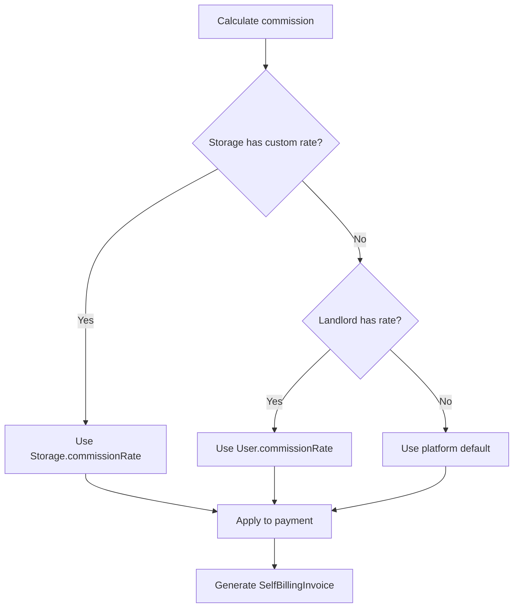
```mermaid
flowchart TD
    A[Calculate commission] --> B{Storage has custom rate?}

    B -->|Yes| C[Use Storage.commissionRate]
    B -->|No| D{Landlord has rate?}

    D -->|Yes| E[Use User.commissionRate]
    D -->|No| F[Use platform default]

    C --> G[Apply to payment]
    E --> G
    F --> G

    G --> H[Generate SelfBillingInvoice]
```

### Audit Log Recording

```mermaid
flowchart LR
    A[Entity operation] --> B{Operation type}

    B -->|CREATE| C[Log CREATE event]
    B -->|UPDATE| D[Log UPDATE event]
    B -->|DELETE| E[Log DELETE event]

    C --> F[AuditLog entry]
    D --> F
    E --> F

    F --> G[Store: entityType, entityId]
    F --> H[Store: eventType, payload]
    F --> I[Store: user, ipAddress]
    F --> J[Store: createdAt]
```

### Full Order Journey

```mermaid
journey
    title Customer Order Journey
    section Discovery
      Browse storage locations: 5: Customer
      View available types: 4: Customer
      Check prices: 4: Customer
    section Selection
      Pick storage type: 4: Customer
      Select dates: 4: Customer
      Choose specific unit (if non-uniform): 3: Customer
    section Checkout
      Fill contact details: 3: Customer
      Review order: 4: Customer
      Proceed to payment: 4: Customer
    section Payment
      GoPay payment page: 3: Customer, GoPay
      Complete payment: 5: Customer
      Receive confirmation: 5: Customer
    section Post-Order
      Receive invoice email: 5: System
      Contract created: 5: System
      Access storage: 5: Customer
    section Ongoing (Unlimited)
      Monthly billing: 4: System
      Receive monthly invoice: 4: Customer
      Terminate when done: 4: Customer
```

### Storage Unavailability Handling

```mermaid
flowchart TD
    A[Check storage availability] --> B[Get all StorageUnavailability]
    B --> C{Any overlaps with requested dates?}

    C -->|No overlaps| D[Storage is available]
    C -->|Has overlap| E[Storage is unavailable]

    subgraph Overlap Check
        F[Requested: Jan 1 - Jan 15]
        G[Unavailability: Jan 10 - Jan 20]
        H[Result: OVERLAP - unavailable]
        F --> H
        G --> H
    end

    subgraph Indefinite
        I[Unavailability: Jan 10 - NULL]
        J[Any date >= Jan 10 is blocked]
        I --> J
    end

    D --> K[Allow order creation]
    E --> L[Show error, pick different dates]
```

---

This documentation provides a complete domain understanding for development, testing, and onboarding.
